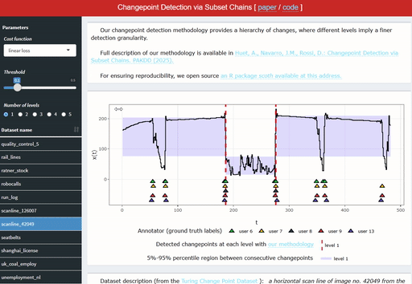

# Changepoint Detection via Subset Chains


This repository contains the implementation of the Change point detection methodology based on chain of subsets and SCOres & THresholds (SCOTH) published in PAKDD'25 (see [Reference](#Reference)). 

An interactive demo of of SCOTH is accessible at [https://huet.shinyapps.io/scoth-segmentation/](https://huet.shinyapps.io/scoth-segmentation/)



## Features

Given a time series, the change point detection task consists in finding the instants where the statistical distribution of the series abruptly changes. The classic approach based on optimization techniques are too rigid and entangled, for which recent approaches advocate building a complete solution path, ranking all the possible change points of the series.

SCOTH  extends this paradigm by providing a chain of subsets, corresponding to a hierarchy of changes, where different levels imply a finer detection granularity. Our proposal is to compute all levels from a single score vector through a recursive thresholding mechanism, where the threshold maps to the desired detection granularity. We contrast our proposal against state-of-the-art approaches on public benchmarks with human expert labeling, showing that SCOTH provides: 
-  best-in class performance (overall F1-score of 0.87), 
-  a statistically significant and remarkable improvement over the state of the art in the practical case where a single cost function and threshold setting is selected over multiple levels (F1-score of 0.76) and 
- a qualitative alignment with different human experts for different levels, suggesting that each expert may find a different suitable level in practice.


## Implementation 

The implementation in this repository has the form of an R package named `scoth`, providing:

- An implementation of the algorithms 1 and 2 presented in the paper,
- The end-to-end pipeline for our methodology, with in particular the results table and the qualitative results figure from the raw input data,
- The end-to-end pipeline for the state-of-the-art methodologies, with in particular the CD plot results.
 

## Quick start

After the extraction of the source to a certain folder `path_to_folder`, the package can be installed within an R session using:

````
install.packages(path_to_folder, repos = NULL, type="source")
````

The installation of the R dependencies (that are listed in the `DESCRIPTION` file) is managed automatically. After installation, the main script for reproducing the experiments using our methodology can be executed using:

````
Rscript path_to_folder/experiments/main.R
````

The additional script for performing the comparison against the state-of-the-art methodologies needs the following python packages: `river` (>= 0.21.1), `changeforest` (>= 1.1.4) and `numpy` (>= 1.26.4). The `PYTHON_FOLDER` path should also be specified in the `experiments/main_sota.R` script. The code can then be executed using:

````
Rscript path_to_folder/experiments/main_sota.R
````

The output folders and files are located in `path_to_folder/output-data`.

## General organization

The core algorithmic parts of the methodology are located in `scoth_scoring_algorithm.R` and `scoth_selection_algorithm.R`.

The pipeline is organized into successive steps: data and ground truth loading (`load_data.R`), scoring (`pipeline_scoring.R`), selection (`pipeline_selection.R`), evaluation (`pipeline_evaluation.R`), summarization (`pipeline_summarization.R`) and outputs (`output_tables.R` and `output_plots.R`).

Additional files define the used cost functions (`cost_functions.R`) and the evaluation metrics (`metrics_F1.R` and `metrics_TCPD.R`).

The remaining source files apply the same pipeline for the other state-of-the-art methodologies.

For details regarding a particular step, please refer to the documentation available within each file.

## Table of results

Please find the table of the different results of the paper produced by our code.

Result description | Command to execute | Output file path
--- | --- | ---
Result table, our method, oracle setting | `Rscript path_to_folder/experiments/main.R` | `output-data/table_left.txt`
Result table, our method, single-best setting | `Rscript path_to_folder/experiments/main.R` | `output-data/table_right.txt`
Result table, sota methods, oracle setting | `Rscript path_to_folder/experiments/main_sota.R` | `output-data/sota/table_left.txt`
Result table, sota methods, single-best setting | `Rscript path_to_folder/experiments/main_sota.R` | `output-data/sota/table_right.txt`
CD plot figure, oracle setting | `Rscript path_to_folder/experiments/main_sota.R` | `output-data/sota/CD_oracle.pdf`
CD plot figure, single-best setting | `Rscript path_to_folder/experiments/main_sota.R` | `output-data/sota/CD_single_best.pdf`
Qualitative results figure | `Rscript path_to_folder/experiments/main.R` | `output-data/figure_qualitative_results.pdf`

## Unit tests

The core methodological components have been unit tested (available in `path_to_folder/tests/testthat`). The tests can be executed directly within an R session using `devtools::test()`. They have been useful for checking the corner cases, and might also provide a better intuition and understanding of the different steps of the methodology.

## Reference

If you use this package, please acknowledge our work by citing the following PAKDD'25 paper https://dl.acm.org/doi/10.1007/978-981-96-8183-9_19:

```
@inproceedings{scoth2025pakdd,
author = {Huet, Alexis and Navarro, Jose Manuel and Rossi, Dario},
title = {Changepoint Detection via Subset Chains},
year = {2025},
doi = {10.1007/978-981-96-8183-9_19},
booktitle = {29th Pacific-Asia Conference on Knowledge Discovery and Data Mining (PAKDD'25)},
}
```

